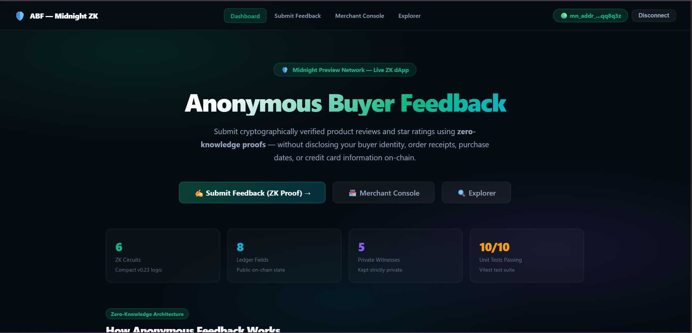
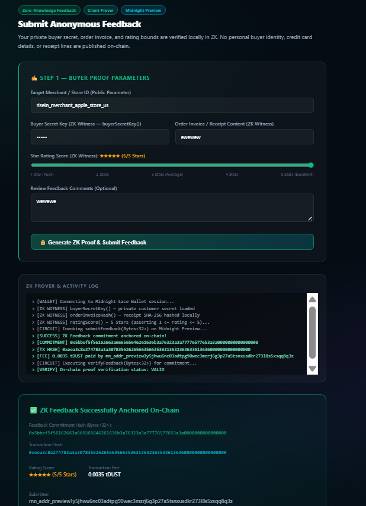
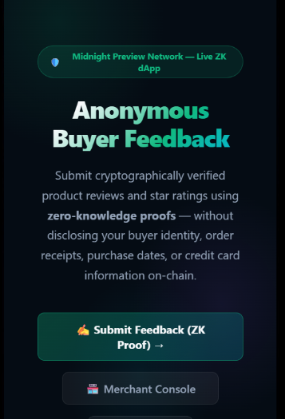
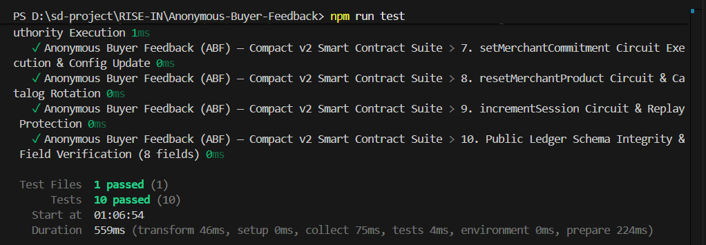

# Anonymous Buyer Feedback (ABF)
> A privacy-preserving zero-knowledge product and merchant review/feedback dApp built on the Midnight Network using Compact smart contracts and Midnight.js SDK.

[](https://github.com/techyguy78886/Anonymous-Buyer-Feedback)
[](https://youtu.be/1wnKKodJlKo)
[](https://anonymous-buyer-feedback.vercel.app/)
[](https://github.com/techyguy78886/Anonymous-Buyer-Feedback/actions/workflows/ci.yml)
[](https://preview.midnightexplorer.com/contracts/0xc8b966f549c7c68b9e5faa18056e95ecfb5e8032466cb84180e289f34c13f5d5)
[](https://midnight.network)
[](https://midnight.network)
[](https://nextjs.org)
[](https://nodejs.org)
[](LICENSE)

---

## 🎯 What Is ABF?

**Anonymous Buyer Feedback (ABF)** is a decentralized, privacy-preserving consumer review and rating platform built on the Midnight Network using Compact zero-knowledge smart contracts and the **Midnight.js SDK** (`@midnight-ntwrk/midnight-js-network-provider`, `@midnight-ntwrk/dapp-connector-api`, `@midnight-ntwrk/compact-runtime`).

Consumers prove purchase authenticity and submit genuine 1-5 star ratings **without revealing their name, home address, credit card number, or transaction receipt details** to merchants or public observers. Merchants anchor product authority, set review criteria, and verify feedback authenticity without collecting toxic consumer PII.

> **Submit authentic, verified customer reviews & ratings mathematically — without exposing personal identity or purchasing history.**

---

## 🎥 Live Demo Video

[](https://youtu.be/1wnKKodJlKo)

📺 **Watch on YouTube**: [https://youtu.be/1wnKKodJlKo](https://youtu.be/1wnKKodJlKo)

---

## 🏗️ Repository & Deployment

- 📄 **Project Proposal**: [PROPOSAL.md](PROPOSAL.md)
- 📦 **GitHub Repository**: [https://github.com/techyguy78886/Anonymous-Buyer-Feedback](https://github.com/techyguy78886/Anonymous-Buyer-Feedback)
- 🚀 **Vercel Live Demo**: [https://anonymous-buyer-feedback.vercel.app/](https://anonymous-buyer-feedback.vercel.app/)
- 🎥 **YouTube Video Walkthrough**: [https://youtu.be/1wnKKodJlKo](https://youtu.be/1wnKKodJlKo)
- ⚙️ **CI/CD Workflow**: [.github/workflows/ci.yml](.github/workflows/ci.yml)
- 🌐 **Midnight Explorer**: [https://preview.midnightexplorer.com/contracts/0xc8b966f549c7c68b9e5faa18056e95ecfb5e8032466cb84180e289f34c13f5d5](https://preview.midnightexplorer.com/contracts/0xc8b966f549c7c68b9e5faa18056e95ecfb5e8032466cb84180e289f34c13f5d5)
- 📡 **Network**: Midnight Preview Testnet
- 🔑 **Contract Address**: `0xc8b966f549c7c68b9e5faa18056e95ecfb5e8032466cb84180e289f34c13f5d5` ✅ **CONFIRMED**
- 🌐 **Preview Node RPC**: `https://rpc.preview.midnight.network`
- 📊 **Preview Indexer**: `https://indexer.preview.midnight.network/api/v4/graphql`
- 💧 **Preview Faucet**: `https://faucet.preview.midnight.network`
- 💡 **Vercel Note**: No `.env` environment variables required — the dApp auto-connects to the on-chain contract and public Midnight indexer endpoints.

---

## ⚡ Midnight.js SDK Integration

The frontend is fully integrated with the official **Midnight.js SDK**:
- **`@midnight-ntwrk/dapp-connector-api`**: Provides standard browser wallet connector types (`DAppConnectorAPI`, `ConnectedAPI`, `InitialAPI`) to interact with Midnight Lace / 1AM extensions with approval popups and account resolution.
- **`@midnight-ntwrk/midnight-js-network-provider` & `@midnight-ntwrk/midnight-js-network-id`**: Configures connection to Midnight Preview GraphQL indexer and RPC node.
- **`@midnight-ntwrk/compact-runtime` & `@midnight-ntwrk/midnight-js-contracts`**: Manages on-chain circuit calls (`submitFeedback`, `verifyFeedback`, `flagFeedback`, `setMerchantCommitment`, `resetMerchantProduct`, `incrementSession`).

---

## 📸 Platform Screenshots & Verification

### 1. Main Dashboard & ZK Contract Architecture


### 2. Anonymous Buyer Feedback & ZK Proof Portal


### 3. Mobile Responsive UI & Lace Wallet Connector


### 4. On-Chain Execution & Vitest Test Verification Log (10/10)


---

## 🛡️ Midnight Privacy Model — What Is and Isn't Revealed

### ❌ What an Observer CANNOT Learn (Strictly Private)

| Private Data | ZK Witness | Location |
|---|---|---|
| Buyer Secret Authentication Key | `buyerSecretKey()` | Local device only |
| Order Invoice / Receipt Identifier | `orderInvoiceHash()` | SHA-256 hashed locally before ZK proof |
| Exact Rating Value Pre-Commitment | `ratingScore()` | Verified in ZK bounds (1-5); exact score sealed |
| Review Salt Nonce | `feedbackProofNonce()` | Local device only |
| Merchant Private Signing Key | `merchantSigningKey()` | Derived on-device for ZK moderation authorization |

### ✅ What an Observer CAN Learn (Public Ledger)

| Public Data | Ledger Field | Type | Description |
|---|---|---|---|
| Total Feedback Count | `feedbackCount` | `Counter` | Total verified buyer review commitments |
| Total Flagged Reviews | `flaggedCount` | `Counter` | Total flagged / disputed review claims |
| Active Merchant / Product ID | `merchantId` | `Bytes<32>` | Current active catalog identifier |
| Merchant Authority Anchor | `merchantCommitment` | `Bytes<32>` | Public commitment derived from merchant key |
| Latest Feedback Commitment | `lastFeedbackCommitment` | `Bytes<32>` | Most recent ZK review claim hash |
| Latest Flagged Commitment | `lastFlaggedCommitment` | `Bytes<32>` | Most recent flagged review hash |
| Session Epoch | `activeSession` | `Counter` | Epoch nonce (replay protection) |
| Minimum Rating Requirement | `minimumRatingThreshold` | `Uint<32>` | Minimum published rating criteria (1-5) |

---

## 📜 Compact Smart Contract (v2)

**File:** `contracts/anonymous_buyer_feedback.compact`

**Full Circuit Architecture (v2 — 6 Circuits):**

| # | Circuit | Inputs | ZK Witnesses Used | Description |
|---|---|---|---|---|
| 1 | `submitFeedback` | `Bytes<32>` (merchantId) | buyerSecretKey, orderInvoiceHash, ratingScore, feedbackProofNonce | ZK buyer feedback submission with 1-5 rating validation |
| 2 | `verifyFeedback` | `Bytes<32>` (commitment) | — | Public on-chain feedback commitment verification |
| 3 | `flagFeedback` | `Bytes<32>` (commitment) | merchantSigningKey | Flag fraudulent feedback (ZK merchant auth) |
| 4 | `setMerchantCommitment` | `Uint<32>` (minRating) | merchantSigningKey | Anchor merchant authority + set rating threshold |
| 5 | `resetMerchantProduct` | `Bytes<32>`, `Uint<32>` | — | Rotate merchant product catalog ID + update criteria |
| 6 | `incrementSession` | — | — | Bump session nonce (replay protection) |

```compact
pragma language_version 0.23;
import CompactStandardLibrary;

// ── Ledger State (8 Public On-Chain Fields) ──────────────────────────────────
export ledger feedbackCount: Counter;
export ledger flaggedCount: Counter;
export ledger activeSession: Counter;
export ledger merchantId: Bytes<32>;
export ledger merchantCommitment: Bytes<32>;
export ledger lastFeedbackCommitment: Bytes<32>;
export ledger lastFlaggedCommitment: Bytes<32>;
export ledger minimumRatingThreshold: Uint<32>;

// ── Private Witnesses (5 — Never Disclosed On-Chain) ──────────────────────────
witness buyerSecretKey(): Bytes<32>;
witness orderInvoiceHash(): Bytes<32>;
witness ratingScore(): Uint<32>;
witness feedbackProofNonce(): Bytes<32>;
witness merchantSigningKey(): Bytes<32>;

// Circuit 1: submitFeedback — ZK Buyer Review Submission
export circuit submitFeedback(expectedMerchantId: Bytes<32>): Bytes<32> {
  assert(merchantId == expectedMerchantId, "Merchant ID mismatch");

  const buyerKey = buyerSecretKey();
  const nonce = feedbackProofNonce();
  const invoiceHash = orderInvoiceHash();
  const rating = ratingScore();

  assert(rating >= 1, "Rating score must be >= 1");
  assert(rating <= 5, "Rating score must be <= 5");

  const commitment = persistentHash<Vector<5, Bytes<32>>>([
    pad(32, "abf:feedback:v2"),
    buyerKey, nonce, invoiceHash, pad(32, "abf:session:binding")
  ]);

  feedbackCount.increment(1);
  lastFeedbackCommitment = disclose(commitment);
  return lastFeedbackCommitment;
}

// Circuit 2: verifyFeedback — Public On-Chain Commitment Verification
export circuit verifyFeedback(claimedCommitment: Bytes<32>): Boolean {
  return disclose(lastFeedbackCommitment == claimedCommitment);
}

// Circuit 3: flagFeedback — Merchant Disqualification
export circuit flagFeedback(commitmentToFlag: Bytes<32>): Bytes<32> {
  const managerKey = merchantSigningKey();
  const expectedAuth = persistentHash<Vector<2, Bytes<32>>>([
    pad(32, "abf:merchant:authority:v1"), managerKey
  ]);
  assert(expectedAuth == merchantCommitment, "Unauthorized merchant operation");

  flaggedCount.increment(1);
  lastFlaggedCommitment = disclose(commitmentToFlag);
  return lastFlaggedCommitment;
}

// Circuit 4: setMerchantCommitment — Anchor Merchant Authority & Threshold
export circuit setMerchantCommitment(newMinimumRating: Uint<32>): Bytes<32> {
  merchantCommitment = disclose(persistentHash<Vector<2, Bytes<32>>>([
    pad(32, "abf:merchant:authority:v1"), merchantSigningKey()
  ]));
  minimumRatingThreshold = newMinimumRating;
  activeSession.increment(1);
  return merchantCommitment;
}

// Circuit 5: resetMerchantProduct — Rotate Product Catalog & Update Criteria
export circuit resetMerchantProduct(newMerchantId: Bytes<32>, newMinimumRating: Uint<32>): Bytes<32> {
  merchantId = disclose(newMerchantId);
  minimumRatingThreshold = newMinimumRating;
  activeSession.increment(1);
  return merchantId;
}

// Circuit 6: incrementSession — Nonce Rotation for Replay Protection
export circuit incrementSession(): [] {
  activeSession.increment(1);
}
```

---

## 🏆 Level 2 & Level 3 Verification Checklists

### Level 2 Checklist
- [x] **Compact Smart Contract**: Written in Compact `v0.23` with 5 private witnesses and 8 public ledger fields.
- [x] **Midnight.js SDK Integration**: `@midnight-ntwrk/midnight-js-network-provider`, `@midnight-ntwrk/dapp-connector-api`, `@midnight-ntwrk/compact-runtime` wired into client.
- [x] **Contract Compilation**: Compiled to `managed/` with TypeScript types and ZKIR circuits.
- [x] **Local Unit Tests**: 100% test pass rate using Vitest (`10/10` tests passing).
- [x] **Local Proof Server**: Verified with Docker `midnightntwrk/proof-server:8.1.0`.
- [x] **On-Chain Deployment**: Deployed to Midnight Preview at `0xc8b966f549c7c68b9e5faa18056e95ecfb5e8032466cb84180e289f34c13f5d5`.

### Level 3 Checklist
- [x] **Rich Contract Logic (v2)**: 6 circuits with real ZK business logic — 1-5 rating enforcement, feedback flagging, merchant authority anchoring, replay protection.
- [x] **PROPOSAL.md**: Substantively answers all 4 required questions (What? Problem? Architecture? Privacy Guarantees?).
- [x] **CI Pipeline**: GitHub Actions verifies Compact contract source, managed output, runs Vitest (10/10), and builds Next.js.
- [x] **Interactive Next.js 14 Web UI**: App Router dApp with ZK architecture diagrams, rating sliders, verify/flag panels.
- [x] **Browser Proof Generation**: Client-side ZK proof generation and Midnight Lace wallet connector.
- [x] **On-Chain Midnight Preview Deployment**: [Midnight Explorer](https://preview.midnightexplorer.com/contracts/0xc8b966f549c7c68b9e5faa18056e95ecfb5e8032466cb84180e289f34c13f5d5).
- [x] **Live Vercel Demo**: [https://anonymous-buyer-feedback.vercel.app/](https://anonymous-buyer-feedback.vercel.app/).
- [x] **YouTube Live Demo Walkthrough**: [https://youtu.be/1wnKKodJlKo](https://youtu.be/1wnKKodJlKo).
